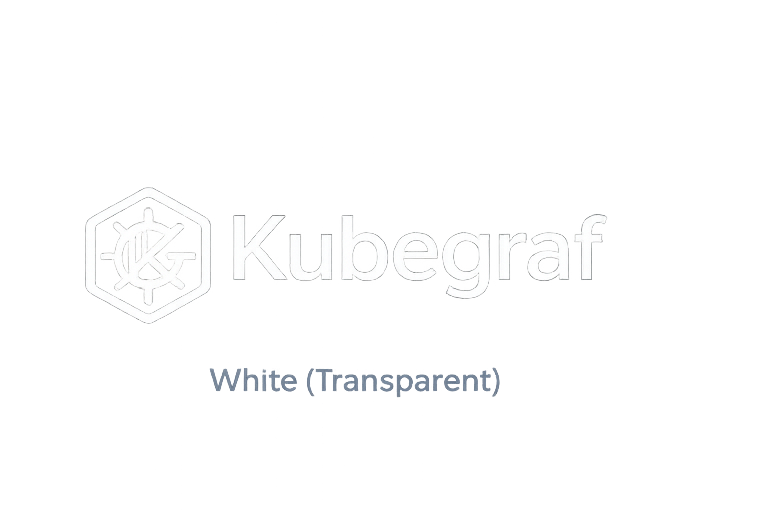
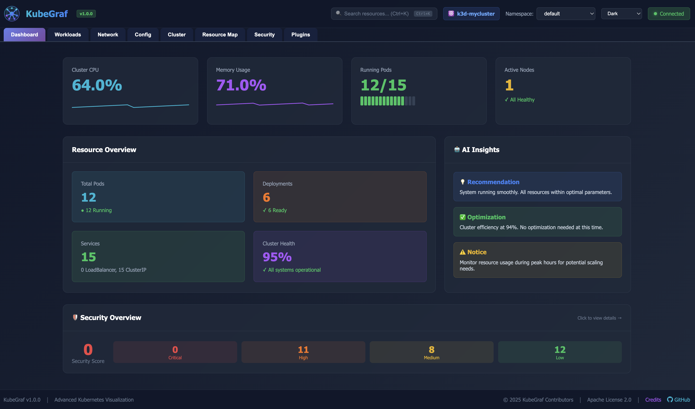

<div align="center">
  
  <br/><br/>

  **Incident Intelligence for Kubernetes**

  [](https://github.com/kubegraf/kubegraf/releases/latest)
  [](https://golang.org)
  [](LICENSE)
  [](https://github.com/kubegraf/kubegraf/stargazers)

  **[Website](https://kubegraf.io)** · **[Documentation](https://kubegraf.io/docs/)** · **[Releases](https://github.com/kubegraf/kubegraf/releases)**
</div>

---

## What is KubeGraf?

KubeGraf is a **local-first Kubernetes management platform** that helps you detect incidents, understand root causes, and safely respond to failures — without SaaS lock-in.

It runs entirely on your machine and connects to any cluster your `kubectl` can reach. No Helm, no cluster-side install — just download and run.

> **Launch: 23 March 2026** — v1.0.0 coming soon.

### Why KubeGraf?

- **🔍 Incident Intelligence** — Automatically detects failure patterns and provides evidence-backed diagnoses
- **🛡️ Safe Operations** — Preview all changes before applying, with dry-run validation
- **🏠 Local-First** — Runs entirely on your machine, no data leaves your environment
- **⚡ Fast & Lightweight** — Single binary, zero external dependencies
- **🤖 AI-Powered** — Orkas AI agent helps investigate and resolve incidents

---

## Install

### macOS

**Homebrew (recommended):**

```bash
brew install kubegraf/tap/kubegraf
```

**Direct download:**

```bash
# Apple Silicon (M1/M2/M3/M4)
curl -L https://github.com/kubegraf/kubegraf/releases/latest/download/kubegraf-darwin-arm64.tar.gz | tar xz
sudo mv kubegraf /usr/local/bin/

# Intel
curl -L https://github.com/kubegraf/kubegraf/releases/latest/download/kubegraf-darwin-amd64.tar.gz | tar xz
sudo mv kubegraf /usr/local/bin/
```

### Windows

**Scoop (recommended — no admin required, no SmartScreen):**

```powershell
scoop bucket add kubegraf https://github.com/kubegraf/scoop-bucket
scoop install kubegraf
```

**Direct download:**

Download the latest `.zip` from [Releases](https://github.com/kubegraf/kubegraf/releases/latest), extract, and add the folder to your `PATH`.

### Linux

```bash
# amd64
curl -L https://github.com/kubegraf/kubegraf/releases/latest/download/kubegraf-linux-amd64.tar.gz | tar xz
sudo mv kubegraf /usr/local/bin/

# arm64
curl -L https://github.com/kubegraf/kubegraf/releases/latest/download/kubegraf-linux-arm64.tar.gz | tar xz
sudo mv kubegraf /usr/local/bin/
```

**Verify:**

```bash
kubegraf --version
```

---

## Quick Start

```bash
kubegraf web --port=3000
```

Open [http://localhost:3000](http://localhost:3000) in your browser.

KubeGraf reads your existing `~/.kube/config` automatically. Switch between clusters from the UI — no extra configuration needed.

<div align="center">
  
</div>

---

## Authentication

KubeGraf supports all standard Kubernetes auth methods out of the box:

| Auth method | Example | Supported |
|---|---|---|
| Certificate (client cert/key) | Most self-hosted clusters | ✅ |
| Bearer token | Service accounts | ✅ |
| OIDC | EKS + OIDC, Dex, Keycloak | ✅ |
| GKE / GCP | `auth-provider: name: gcp` | ✅ |
| Azure | `auth-provider: name: azure` | ✅ |
| AWS IAM (`exec`) | `aws-iam-authenticator`, `kubelogin` | ✅ |
| Generic `exec` | Any credential plugin | ✅ |

> Enterprise clusters using OIDC work out of the box — no extra flags or environment variables needed.

---

## Key Features

### 🧠 Incident Intelligence

Automatically detects and diagnoses Kubernetes failures:

- **Failure Pattern Detection** — CrashLoopBackOff, OOM, Restart Storms, Image Pull failures, Service Endpoint failures, and more
- **Evidence-Backed Diagnosis** — Every conclusion backed by events, container logs, resource status, and recent config changes
- **Safe Fix Recommendations** — Dry-run validation, diff view, risk assessment, and rollback suggestions
- **Knowledge Bank** — Local SQLite incident history, learnable patterns, export/import for teams
- **Auto-Remediation** — Optional guarded automation with confidence thresholds

### 🎛️ Core Capabilities

- **Resource Management** — Pods, Deployments, StatefulSets, DaemonSets, Services, Ingresses, ConfigMaps, Secrets, and more
- **Real-time Monitoring** — Live CPU and memory metrics with WebSocket updates
- **Pod Operations** — Shell access, log streaming, restart, delete, port forwarding
- **Security Analysis** — Automated security posture assessment (0–100 score)
- **Multi-Cluster** — Switch between Kubernetes contexts with aggregated summaries
- **Visualization** — Interactive topology views

### 🤖 AI Integration

- **Orkas AI Agent** — Incident investigation, root cause analysis, and fix recommendations
- **Multiple Providers** — Ollama (local), OpenAI, Claude
- **MCP Support** — Model Context Protocol for tool-augmented AI workflows

---

## Usage

### Start the web dashboard

```bash
kubegraf web --port=3000
# Open: http://localhost:3000
```

### Incident Intelligence

1. Start the dashboard: `kubegraf web --port=3000`
2. Navigate to **Sidebar → AI → Intelligence → Incident Intelligence**
3. View detected incidents with evidence-backed diagnoses
4. Click any incident to see summary, evidence, recommended fixes, and timeline

---

## Requirements

- `kubectl` configured with cluster access (`~/.kube/config`)
- Kubernetes 1.28 or later
- Modern browser (Chrome, Firefox, Safari, Edge)

---

## Releases

All releases are on the [Releases](https://github.com/kubegraf/kubegraf/releases) page:

- Pre-built binaries for macOS, Linux, Windows (amd64 + arm64)
- SHA-256 checksums (`checksums.txt`)
- Release notes

---

## Documentation

- **[Full Documentation](https://kubegraf.io/docs/)** — User guide and API reference
- **[Installation Guide](https://kubegraf.io/docs/installation.html)** — Detailed installation steps

---

## Support

- **Docs:** [kubegraf.io/docs](https://kubegraf.io/docs/)
- **Bug reports:** [GitHub Issues](https://github.com/kubegraf/kubegraf/issues/new?template=bug_report.yml)
- **Feature requests:** [GitHub Issues](https://github.com/kubegraf/kubegraf/issues/new?template=feature_request.yml)
- **Email:** [contact@kubegraf.io](mailto:contact@kubegraf.io)

---

## Security

To report a vulnerability, email **contact@kubegraf.io** with subject "Security: \<title\>". See [SECURITY.md](SECURITY.md) for our disclosure policy.

---

## License

Apache 2.0 — see [LICENSE](LICENSE).

---

<div align="center">

**[Get Started](https://kubegraf.io)** · **[Documentation](https://kubegraf.io/docs/)** · **[Report Bug](https://github.com/kubegraf/kubegraf/issues)**

</div>
