# KubeGraf Architecture Diagrams

This document contains Mermaid diagrams visualizing the KubeGraf architecture.

---

## Table of Contents

1. [System Architecture Overview](#1-system-architecture-overview)
2. [Frontend Component Hierarchy](#2-frontend-component-hierarchy)
3. [Backend API Structure](#3-backend-api-structure)
4. [Frontend-Backend Communication Flow](#4-frontend-backend-communication-flow)
5. [State Management Flow](#5-state-management-flow)
6. [Authentication Flow](#6-authentication-flow)
7. [WebSocket Communication](#7-websocket-communication)
8. [Incident Intelligence Flow](#8-incident-intelligence-flow)
9. [Execution Pipeline](#9-execution-pipeline)
10. [Cluster Switching Flow](#10-cluster-switching-flow)
11. [Port Forwarding Flow](#11-port-forwarding-flow)
12. [ML Job Workflow](#12-ml-job-workflow)

---

## 1. System Architecture Overview

```mermaid
graph TB
    subgraph "User Environment"
        User["👤 User"]
        Browser["🌐 Web Browser"]
    end

    subgraph "KubeGraf Desktop App"
        subgraph "Frontend Layer"
            SPA["SolidJS SPA<br/>80+ Components<br/>70+ Routes<br/>22 Stores"]
            Router["Router"]
            StateManager["State Management<br/>TanStack Query"]
        end

        subgraph "Backend Layer"
            WebServer["Go Web Server<br/>200+ API Routes"]
            WSServer["WebSocket Server<br/>6 Endpoints"]
            Intelligence["Intelligence Engine<br/>AI/ML"]
            MetricsCollector["Metrics Collector"]
            EventMonitor["Event Monitor"]
        end

        subgraph "Data Layer"
            Cache["LRU Cache<br/>10,000 items"]
            SQLite["SQLite DB<br/>Local Storage"]
        end
    end

    subgraph "Kubernetes Cluster"
        K8sAPI["Kubernetes API Server"]
        Pods["Pods"]
        Nodes["Nodes"]
        Services["Services"]
        Deployments["Deployments"]
    end

    User --> Browser
    Browser --> SPA
    SPA --> Router
    Router --> StateManager
    StateManager <--> WebServer
    StateManager <--> WSServer

    WebServer --> Intelligence
    WebServer --> MetricsCollector
    WebServer --> EventMonitor
    WebServer --> Cache
    WebServer --> SQLite

    WebServer --> K8sAPI
    K8sAPI --> Pods
    K8sAPI --> Nodes
    K8sAPI --> Services
    K8sAPI --> Deployments

    style User fill:#4A90E2
    style Browser fill:#50C878
    style SPA fill:#FF6B6B
    style WebServer fill:#FFA500
    style K8sAPI fill:#326CE5
```



---

## 2. Frontend Component Hierarchy


---

## 3. Backend API Structure


---

## 4. Frontend-Backend Communication Flow


---

## 5. State Management Flow


---

## 6. Authentication Flow


---

## 7. WebSocket Communication


---

## 8. Incident Intelligence Flow


---

## 9. Execution Pipeline


---

## 10. Cluster Switching Flow


---

## 11. Port Forwarding Flow


---

## 12. ML Job Workflow


---

## 13. Application Marketplace Flow


---

## 14. Sidebar Navigation Structure

```mermaid
graph TB
    Sidebar["SidebarV2<br/>2-Panel Design"]

    subgraph "Sidebar Rail (14px)"
        Rail1["📊 Overview"]
        Rail2["🧠 Insights"]
        Rail3["🚀 CD"]
        Rail4["⚙️ Workloads"]
        Rail5["🌐 Networking"]
        Rail6["📦 Config & Storage"]
        Rail7["🔒 Access Control"]
        Rail8["🏗️ Platform"]
        Rail9["🤖 Intelligence"]
        Rail10["🔬 Machine Learning"]
        Rail11["🔧 Custom Resources"]
        Rail12["⚙️ Settings"]
    end

    subgraph "Flyout Menu (Expands on Hover)"
        Section1["Overview<br/>• Dashboard<br/>• Cluster Overview<br/>• Multi-Cluster<br/>• Events"]
        Section2["Insights<br/>• Incidents<br/>• Timeline<br/>• AI/ML Insights<br/>• Security<br/>• Cost<br/>• Drift<br/>• Continuity"]
        Section4["Workloads<br/>• Pods<br/>• Deployments<br/>• StatefulSets<br/>• DaemonSets<br/>• Jobs<br/>• CronJobs<br/>• PDB<br/>• HPA"]
        Section5["Networking<br/>• Services<br/>• Ingress<br/>• Network Policies"]
        Section9["Intelligence<br/>• AI Assistant<br/>• AutoFix Engine<br/>• SRE Agent<br/>• Knowledge Bank"]
        Section10["Machine Learning<br/>• Training Jobs<br/>• Inference Services<br/>• MLflow<br/>• Feast<br/>• GPU Dashboard"]
    end

    Sidebar --> Rail1
    Sidebar --> Rail2
    Sidebar --> Rail3
    Sidebar --> Rail4
    Sidebar --> Rail5
    Sidebar --> Rail6
    Sidebar --> Rail7
    Sidebar --> Rail8
    Sidebar --> Rail9
    Sidebar --> Rail10
    Sidebar --> Rail11
    Sidebar --> Rail12

    Rail1 -.->|Hover| Section1
    Rail2 -.->|Hover| Section2
    Rail4 -.->|Hover| Section4
    Rail5 -.->|Hover| Section5
    Rail9 -.->|Hover| Section9
    Rail10 -.->|Hover| Section10

    style Sidebar fill:#4A90E2
    style Rail1 fill:#50C878
    style Section1 fill:#FFA500
```



---

## 15. Data Flow - Pod Management


---

## 16. Real-Time Metrics Flow


---

## 17. Intelligence Engine Architecture


---

## Usage

These diagrams are written in Mermaid syntax and can be:
- Viewed in GitHub (automatic rendering)
- Rendered in VSCode with Mermaid preview extensions
- Exported to PNG/SVG using Mermaid CLI
- Embedded in documentation sites

### Viewing in VSCode

Install the "Markdown Preview Mermaid Support" extension:
```bash
code --install-extension bierner.markdown-mermaid
```

Then open this file and use "Markdown: Open Preview" (Ctrl+Shift+V).

### Exporting to PNG

Using Mermaid CLI:
```bash
npm install -g @mermaid-js/mermaid-cli
mmdc -i ARCHITECTURE_DIAGRAMS.md -o diagrams/ -e png
```

---

**End of Architecture Diagrams**
