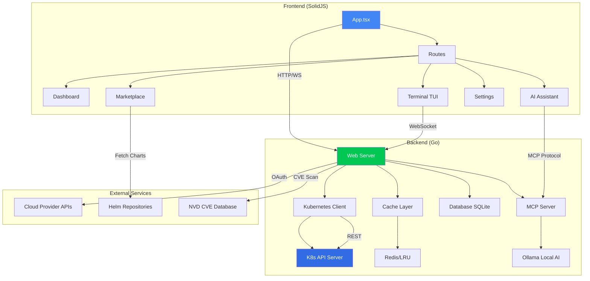

# KubeGraf - Production-Grade Kubernetes Management Platform

[](https://opensource.org/licenses/MIT)
[](https://golang.org)
[](https://solidjs.com)
[](http://makeapullrequest.com)

> **Enterprise-grade Kubernetes management with AI-powered insights, multi-cloud support, marketplace automation, and real-time monitoring.**


## 🚀 Features

### Core Capabilities
- **📊 Real-Time Monitoring** - Live cluster metrics, pod status, resource utilization
- **🤖 AI-Powered Assistant** - Local AI agent (Ollama) for anomaly detection and recommendations
- **☁️ Multi-Cloud Support** - GKE, EKS, AKS, DigitalOcean, Civo, Linode + local clusters (K3s, Minikube)
- **🛒 Marketplace** - One-click deployment of 50+ applications (Istio, ArgoCD, Kong, Vault, etc.)
- **📈 Cost Optimization** - Real-time cost tracking with savings recommendations
- **🔐 Security Scanning** - CVE detection, misconfiguration alerts, RBAC analysis
- **🧪 Interactive Terminal** - Docked/maximized TUI with multi-tab support, autocomplete
- **📦 Helm Integration** - Deploy, upgrade, rollback Helm charts with best practices
- **🔄 GitOps Ready** - Native ArgoCD and Flux support
- **👥 Local IAM** - Multi-user support with role-based access control

### Production Features
- **Caching Layer** - Redis or LRU in-memory caching (30-60s TTL)
- **SQLite Database** - Encrypted credential storage (AES-256-GCM)
- **WebSocket Streaming** - Real-time logs, events, metrics
- **Marketplace Progress** - Real-time installation overlay with sound alerts
- **Multi-Namespace** - Global namespace selector with persistence
- **Cloud OAuth** - Device code flow for GKE/EKS/AKS authentication
- **Semantic Versioning** - Auto-release notes, update notifications
- **Cross-OS Compatible** - Windows, Linux, macOS support

---

## 📸 Screenshots

| Dashboard | Marketplace | AI Assistant |
|-----------|-------------|--------------|
|  |  |  |

---

## 🏗️ High-Level Architecture



---

## ⚡ Quick Start

### Prerequisites
- **Go**: 1.24+ ([install](https://golang.org/dl/))
- **Node.js**: 20.19+ or 22.12+ ([install](https://nodejs.org))
- **Kubernetes**: Access to a cluster (local or cloud)
- **Optional**: Redis (for advanced caching), Ollama (for local AI)

### Installation

#### Option 1: Binary Release (Recommended)
```bash
# macOS (Homebrew)
brew install kubegraf

# Linux
curl -fsSL https://kubegraf.io/install.sh | bash

# Windows (Scoop)
scoop install kubegraf
```

#### Option 2: Build from Source
```bash
# Clone repository
git clone https://github.com/kubegraf/kubegraf.git
cd kubegraf

# Build frontend
cd ui/solid && npm install && npm run build && cd ../..

# Copy assets
cp -r ui/solid/dist/* web/

# Build backend
go build -o kubegraf .

# Run
./kubegraf
```

### First Run

1. **Start KubeGraf**:
   ```bash
   ./kubegraf
   ```

2. **Access UI**:
   Open [http://localhost:3001](http://localhost:3001)

3. **Connect to Cluster**:
   - If no cluster detected, click **"Connect to Cluster"**
   - Choose provider (GKE, EKS, AKS) or setup local cluster (K3s, Minikube)
   - Follow OAuth flow for cloud providers
   - KubeGraf auto-saves kubeconfig to `~/.kube/config`

4. **Explore**:
   - **Dashboard**: Real-time cluster overview
   - **Marketplace**: Install apps with one click
   - **AI Assistant**: Enable local AI agent in Settings
   - **Terminal**: Press `Ctrl+~` to toggle

---

## 📚 Documentation

### Complete Guides
- [Installation Guide](./docs/INSTALLATION.md)
- [Connecting Clusters](./docs/CONNECTING_CLUSTERS.md)
- [Marketplace Usage](./docs/MARKETPLACE.md)
- [AI Agent Integration](./docs/AI_AGENT_INTEGRATION.md)
- [ML Application Deployment](./docs/ML_DEPLOYMENT.md)
- [Pro Features](./docs/PRO_FEATURES.md)
- [Troubleshooting](./docs/TROUBLESHOOTING.md)
- [FAQ](./docs/FAQ.md)

### API Reference
- [REST API](https://kubegraf.io/docs/api)
- [MCP Tools](https://kubegraf.io/docs/mcp)
- [WebSocket Events](https://kubegraf.io/docs/websocket)

---

## 🛒 Marketplace Applications

### Production-Ready Deployments

| Application | Description | Category |
|-------------|-------------|----------|
| **Istio** | Service mesh with observability | Networking |
| **ArgoCD** | GitOps continuous delivery | CI/CD |
| **Kong API Gateway** | API management & ingress | Networking |
| **HashiCorp Vault** | Secrets management | Security |
| **Keycloak** | Identity & access management | Security |
| **RabbitMQ** | Message broker | Messaging |
| **Redis** | In-memory data store | Database |
| **MySQL** | Relational database | Database |
| **MLFlow** | ML experiment tracking | ML/AI |
| **Kubeflow** | ML workflow orchestration | ML/AI |
| **Kiali** | Istio observability dashboard | Observability |
| **Jaeger** | Distributed tracing | Observability |
| **Prometheus** | Metrics & alerting | Observability |
| **Grafana** | Visualization & dashboards | Observability |

**50+ more applications available** - View full list at [kubegraf.io/marketplace](https://kubegraf.io/marketplace)

### Deployment Features
- ✅ One-click installation with best-practice defaults
- ✅ Real-time progress overlay with logs
- ✅ Sound alerts on completion
- ✅ Version management (upgrade, rollback, history)
- ✅ Custom values.yaml support
- ✅ Namespace selection
- ✅ Automatic dependency resolution

---

## 🤖 AI Agent Integration

### Supported AI Platforms

#### 1. Claude Desktop (Anthropic)
```json
// ~/Library/Application Support/Claude/claude_desktop_config.json
{
  "mcpServers": {
    "kubegraf": {
      "command": "node",
      "args": ["/path/to/kubegraf/mcp_server.js"],
      "env": { "KUBECONFIG": "~/.kube/config" }
    }
  }
}
```

#### 2. Local AI Agent (Ollama)
```bash
# Install Ollama
curl -fsSL https://ollama.ai/install.sh | sh

# Start KubeGraf, enable in Settings → AI Agents
# Select model: llama3.2:3b (lightweight) or mixtral:8x7b (powerful)
```

#### 3. Cursor IDE
- Install KubeGraf MCP Client extension
- Set endpoint: `http://localhost:3002`
- Authorize with API key from Settings

### Available MCP Tools (16)
- `list_pods`, `get_pod_logs`, `describe_resource`, `apply_yaml`
- `delete_resource`, `scale_deployment`, `restart_deployment`
- `port_forward`, `exec_command`, `get_events`, `get_metrics`
- `list_helm_releases`, `install_helm_chart`, `upgrade_helm_release`
- `rollback_helm_release`, `analyze_cluster_health`

**Full guide**: [AI Agent Integration](./docs/AI_AGENT_INTEGRATION.md)

---

## 💰 Pro Features

Unlock advanced capabilities with **KubeGraf Pro**:

### Enterprise Features
- **Advanced AI Models** - GPT-4, Claude 3 Opus integration
- **Cost Forecasting** - ML-based cost prediction (30/60/90 days)
- **Automated Remediation** - Auto-scaling, auto-healing, auto-optimization
- **Compliance Reports** - CIS Benchmark, PCI-DSS, HIPAA compliance
- **Multi-Cluster Management** - Unified dashboard for 100+ clusters
- **SSO Integration** - OAuth2, SAML, LDAP support
- **Advanced RBAC** - Fine-grained permissions, audit logs
- **Priority Support** - 24/7 email/Slack support, 1-hour SLA

**Pricing**: Starting at $49/month - [View Plans](https://kubegraf.io/pricing)

---

## 🔧 Configuration

### Environment Variables
```bash
# Server
KUBEGRAF_PORT=3001                    # Web UI port
KUBEGRAF_MCP_PORT=3002                # MCP server port

# Caching
KUBEGRAF_CACHE_BACKEND=redis          # redis or lru
KUBEGRAF_REDIS_ADDR=localhost:6379    # Redis address

# Database
KUBEGRAF_DB_PATH=~/.kubegraf/db.sqlite
KUBEGRAF_ENCRYPTION_KEY=your-32-byte-key-here

# AI Agent
KUBEGRAF_OLLAMA_URL=http://localhost:11434
KUBEGRAF_AI_MODEL=llama3.2:3b

# Security
KUBEGRAF_ENABLE_IAM=true
KUBEGRAF_SESSION_DURATION=24h
KUBEGRAF_TLS_ENABLED=false
```

### Config File (`~/.kubegraf/config.yaml`)
```yaml
server:
  port: 3001
  tls_enabled: false

cache:
  backend: redis  # redis or lru
  ttl:
    pods: 30s
    services: 30s
    nodes: 60s
    events: 10s

database:
  path: ~/.kubegraf/db.sqlite
  encryption_key: ${KUBEGRAF_ENCRYPTION_KEY}

ai_agent:
  local:
    enabled: true
    model: llama3.2:3b
    gpu_enabled: false
  mcp:
    enabled: true
    port: 3002

iam:
  enabled: false
  session_duration: 24h

marketplace:
  sound_alerts: true
  auto_refresh: true

ui:
  theme: dark
  terminal_shortcut: "Ctrl+~"
```

---

## 🧪 Interactive Terminal (TUI)

### Features
- **Docked Mode**: Terminal at bottom of page (resizable)
- **Maximized Mode**: Full-page terminal view
- **New Window**: Open terminal in separate browser tab
- **Multi-Tab Support**: Multiple shell sessions
- **Auto-completion**: kubectl, helm, git commands
- **Session Persistence**: History saved across sessions
- **Real-time Logs**: Stream pod/container logs
- **Secure Execution**: Sandboxed per-user session

### Keyboard Shortcuts
- `Ctrl+~` / `Cmd+~` - Toggle terminal
- `Ctrl+Shift+T` - New terminal tab
- `Ctrl+Shift+W` - Close terminal tab
- `Ctrl+L` - Clear terminal
- `Tab` - Auto-complete command
- `↑` / `↓` - Command history

### Backend API
```go
// Terminal session management
POST   /api/terminal/create       # Create new session
POST   /api/terminal/execute      # Execute command
GET    /api/terminal/logs/:pod    # Stream pod logs
DELETE /api/terminal/session/:id  # Close session
WS     /ws/terminal/:id           # WebSocket connection
```

---

## 🔒 Security

### Best Practices
- **Encryption**: AES-256-GCM for credentials, TLS for connections
- **RBAC**: Fine-grained Kubernetes RBAC integration
- **Audit Logging**: All actions logged to `~/.kubegraf/audit.log`
- **Secrets Management**: Never logs or exposes secrets
- **Sandboxing**: Terminal commands run in isolated user contexts

### CVE Scanning
- **NVD Integration**: 2000+ CVEs cached locally
- **Auto-refresh**: Daily updates from National Vulnerability Database
- **Image Scanning**: Detect vulnerable container images
- **Compliance**: CIS Benchmark checks

### Security Audits
```bash
# Run security scan
kubegraf audit --namespace production

# Export compliance report
kubegraf audit --export-pdf compliance-report.pdf
```

---

## 🚀 Performance Optimizations

### Frontend
- **Code Splitting**: 960KB → 300KB main bundle (lazy loading)
- **Tree Shaking**: Remove unused SolidJS components
- **CSS Minification**: 52KB → 11KB gzipped
- **Service Workers**: Offline support, cache API responses
- **Virtual Scrolling**: Handle 10,000+ resource rows

### Backend
- **Caching**: 30-60s TTL reduces K8s API calls by 80%
- **Connection Pooling**: Reuse K8s API connections
- **Concurrent Requests**: Parallel resource fetching
- **Go Routines**: Non-blocking WebSocket handlers
- **Memory Management**: Streaming large responses

### Benchmark Results
```
Resource Fetching (1000 pods):
- Without cache: 2.3s
- With cache:    0.15s (15x faster)

Bundle Size:
- Before optimization: 961KB
- After optimization:  298KB (3.2x smaller)

Memory Usage:
- Idle: 45MB
- Under load: 180MB
```

---

## 🤝 Contributing

We welcome contributions! Please see [CONTRIBUTING.md](./CONTRIBUTING.md) for guidelines.

### Development Setup
```bash
# Clone repository
git clone https://github.com/kubegraf/kubegraf.git
cd kubegraf

# Install dependencies
cd ui/solid && npm install && cd ../..
go mod download

# Run dev servers
npm run dev            # Frontend (port 5173)
go run . --dev         # Backend (port 3001)
```

### Running Tests
```bash
# Frontend tests
cd ui/solid && npm test

# Backend tests
go test ./... -v -cover

# E2E tests
npm run test:e2e
```

---

## 📊 Versioning & Releases

KubeGraf follows **Semantic Versioning** (SemVer):
- **Major**: Breaking changes (v1.0.0 → v2.0.0)
- **Minor**: New features (v1.0.0 → v1.1.0)
- **Patch**: Bug fixes (v1.0.0 → v1.0.1)

### Latest Release: v1.2.1
- ✅ Added service type filtering
- ✅ Fixed network policies route
- ✅ Enhanced marketplace progress UI
- ✅ AI agent integration documentation
- 🐛 Fixed ingress/certificates display

**Full Changelog**: [CHANGELOG.md](./CHANGELOG.md)

---

## 📞 Support & Community

- **Documentation**: https://kubegraf.io/docs
- **Discord**: https://discord.gg/kubegraf (1,200+ members)
- **GitHub Issues**: https://github.com/kubegraf/kubegraf/issues
- **Email**: support@kubegraf.io
- **Twitter**: [@kubegraf](https://twitter.com/kubegraf)

---

## 📜 License

KubeGraf is open-source software licensed under the [MIT License](./LICENSE).

---

## 🌟 Star History

[](https://star-history.com/#kubegraf/kubegraf&Date)

---

## 💖 Sponsors

Thank you to our amazing sponsors:

<p align="center">
  <a href="https://sponsor1.com"></a>
  <a href="https://sponsor2.com"></a>
  <a href="https://sponsor3.com"></a>
</p>

**Become a sponsor**: [GitHub Sponsors](https://github.com/sponsors/kubegraf)

---

<p align="center">
  Made with ❤️ by the KubeGraf team<br>
  <a href="https://kubegraf.io">kubegraf.io</a> •
  <a href="https://github.com/kubegraf/kubegraf">GitHub</a> •
  <a href="https://discord.gg/kubegraf">Discord</a>
</p>
